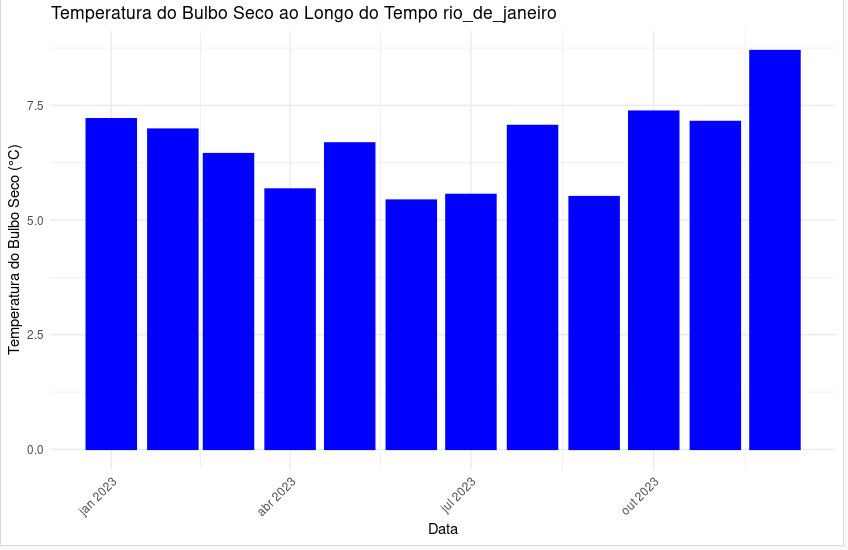
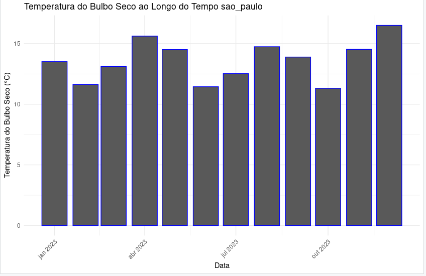
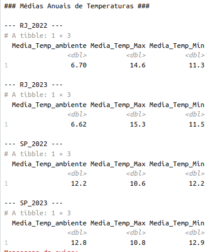

# Arquivo CSV do eleitorado de AM
[Acesse aqui](https://dadosabertos.tse.jus.br/pt_PT/dataset/eleitorado-atual/resource/b5efff39-acfb-4938-b56c-c85c41991bbe)

#   Rio de janeiro

#   Sao paulo

# Estação do rio: Vila militar, estação de são paulo mirante. 
## Em sao paulo a temperatura subiu 

